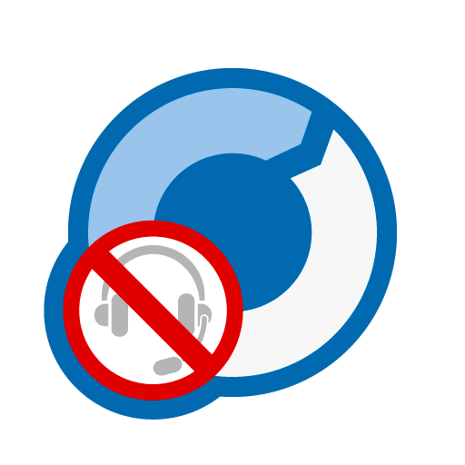

# Customizing "Optimal In-App Remote SDK for iOS" apps

## Remote control feature

Remote control from the remote operators is enabled by default.

With the default setting, when the remote control is requested from the operator, a dialog is displayed and asks user whether to allow remote control. According to user's choices, following actions take place.

- When "Allow" is selected
  - Operators are allowed to remotely control the device.
  - When the operator requests remote control access again, it is accepted automatically without dialog.
- When "Allow(Only once)" is selected
  - Operators are allowed to remotely control the device.
  - When the operator requests remote control access again, dialog is displayed.
- When "Deny" is selected
  - Operator is not allowed to remotely control the device.
  - When the operator requests remote control access again, dialog is displayed.

### Disabling remote control

If remote control operation from remote operators need to be disabled, set "remoteInputEnabled" property to "NO" immediately after creating "ORIASession" class instance. When the property is set to "NO", no dialog prompting for permission is displayed and no remote operation will be executed.

### Allowing remote control operation automatically without permission dialog

If remote control operation from remote operator needs to be allowed without permission dialog, set "remoteInputAcceptsAutomaticallyEnabled" property to "YES" immediately after creating "ORIASession" class instance. When the property is set to "YES", no dialog prompting for permission is displayed and remote operation will be allowed automatically.

## Voice call feature

Voice call with remote operators is disabled by default.

When voice call with remote operators is enabled, voice call session will start when the remote operator requests for voice call.

Icon is displayed during the voice call. Tapping icon displays a menu, which provides users with following options.

- Option to output audio from the speakers (Hands free mode)
  − Option to mute microphone

### Enabling voice call

If voice call with remote operator needs to be allowed, set "voiceChatEnabled" property to "YES" immediately after creating "ORIASession" class instance.

### Output audio from the speakers when no headphone is connected.

If audio needs to be output from the speakers when no headphone is connected, set "voiceChatOverridesSpeakerWhenNoHeadphones" property to "YES" immediately after creating "ORIASession" class instance. Even when this option is set to "YES", sound will be output from headphones when the headphone is connected to the device. However, sound is output from the speakers if device user has selected option to output voice call audio from the speakers.

## Enabling screen sharing for WKWebView

If WKWebView needs to be enabled screen capturing on iOS 8 or later, set "screenSharingBestEffortCaptureEnabled" property to "YES" immediately after creating "ORIASession" class instance.

### Source code example

<details open>
<summary>Swift</summary>

```swift
if let systemVersion = Float(UIDevice.current.systemVersion) {
    session.screenSharingBestEffortCaptureEnabled = systemVersion >= 8.0
}
```

</details>

<details>
<summary>Objective-C</summary>

```objectivec
self.session.screenSharingBestEffortCaptureEnabled = [[[UIDevice currentDevice] systemVersion] floatValue] >= 8.0;
```

</details>

## Switching the display language of the SDK

To switch the language displayed by the SDK in the UI, call the `setLocale` method of the `ORIASession` class as follows.

<details open>
<summary>Swift</summary>

```swift
// Switch to English
self.session.setLocale(Locale.en)

// Switch to Japanese
self.session.setLocale(Locale.ja)

// Follow device settings
self.session.setLocale(Locale.system)
```

</details>

<details>
<summary>Objective-C</summary>

```objc
// Switch to English
[self.session setLocale:LocaleEn];

// Switch to Japanese
[self.session setLocale:LocaleJa];

// Follow device settings
[self.session setLocale:LocaleSystem];
```

</details>

## Design customization of SDK-displayed UI

The images and text of the UI displayed by the SDK can be customized.

### Customizing images

You can customize the UI by replacing the images when following the step [2. Add "OptimalRemoteResources" directory to your project](../README.en.md#2-add-optimalremoteresources-directory-to-your-project).

For example, if you want to change the icon displayed during support, add your customized image to the project with the file name `OptimalRemoteIcon.png`.

The customizable images and their corresponding file names are as follows.

| No. | Image                                | Description                                      | Default                                                                                           | Recommended size (scale for Retina display) |
| --- | ------------------------------------ | ------------------------------------------------ | ------------------------------------------------------------------------------------------------- | ------------------------------------------- |
| 1   | `OptimalRemoteIcon.png`              | Icon displayed during screen sharing             |               | 114 px × 114 px                             |
| 2   | `OptimalRemoteBalloonOnTopRight.png` | Balloon displayed when screen sharing starts     |  | 64 px × 48 px                               |
| 3   | `OptimalRemoteBanner.png`            | Logo image displayed at the top of the screen    |             | 206 px × 32 px                              |
| 4   | `OptimalRemoteTicketBackground.png`  | Background image for the receipt number          |   | 512 px × 210 px                             |
| 5   | `OptimalRemoteSpeakerLoud.png`       | Speaker on button in the screen sharing menu     |        | 144 px × 144 px                             |
| 6   | `OptimalRemoteSpeakerNormal.png`     | Speaker off button in the screen sharing menu    |      | 144 px × 144 px                             |
| 7   | `OptimalRemoteMicOn.png`             | Microphone on button in the screen sharing menu  |              | 144 px × 144 px                             |
| 8   | `OptimalRemoteMicOff.png`            | Microphone off button in the screen sharing menu |             | 144 px × 144 px                             |
| 9   | `OptimalRemoteDisconnect.png`        | Disconnect button in the screen sharing menu     |         | 144 px × 144 px                             |
| 10  | `OptimalRemotePauseIcon.png`         | Icon displayed when screen sharing is paused     |          | 512 px × 512 px                             |

> [!WARNING]
> Only PNG format is supported for images.

> [!WARNING]
> If the image size significantly exceeds or falls below the recommended size, the UI layout may break.

### Customizing text

You can customize the text by editing `OptimalRemoteLocalizable.strings` added in [2. Add "OptimalRemoteResources" directory to your project](../README.en.md#2-add-optimalremoteresources-directory-to-your-project).

- Japanese: [OptimalRemoteResources/ja.lproj/OptimalRemoteLocalizable.strings](../OptimalRemoteResources/ja.lproj/OptimalRemoteLocalizable.strings)
- English: [OptimalRemoteResources/en.lproj/OptimalRemoteLocalizable.strings](../OptimalRemoteResources/en.lproj/OptimalRemoteLocalizable.strings)

For example, the following shows how to change the English label of the disconnect button in the screen sharing menu to `DISCONNECT`.

```diff
--- a/OptimalRemoteResources/en.lproj/OptimalRemoteLocalizable.strings
+++ b/OptimalRemoteResources/en.lproj/OptimalRemoteLocalizable.strings
@@ -53,4 +53,4 @@

 "ORIAAssistiveMenuSpeakerButtonLabel" = "Speaker";
 "ORIAAssistiveMenuMuteButtonLabel" = "Mute";
-"ORIAAssistiveMenuDisconnectButtonLabel" = "Disconnect";
+"ORIAAssistiveMenuDisconnectButtonLabel" = "DISCONNECT";
```

The customizable text and their corresponding keys are as follows.

| No. | Key                                      | Description                                                  | Default (Japanese)                                   | Default (English)                                   |
| --- | ---------------------------------------- | ------------------------------------------------------------ | ---------------------------------------------------- | --------------------------------------------------- |
| 1   | `ORIABalloonTapToExitMessage`            | Text inside the balloon shown at screen sharing start        | `終了する場合は\r\nタップしてください。`             | `Tap above icon to exit.`                           |
| 2   | `ORIADidReserveMessage`                  | Text displayed above the receipt number                      | `下記の受付番号を\r\nオペレーターにお伝えください。` | `Please tell below \r\nReceipt Number to operator.` |
| 3   | `ORIADialogSDPCancelButtonTitleCancel`   | Label of the button displayed below the receipt number       | `中断する`                                           | `Cancel`                                            |
| 4   | `ORIAAssistiveMenuSpeakerButtonLabel`    | Label of the speaker button in the screen sharing menu       | `スピーカー`                                         | `Speaker`                                           |
| 5   | `ORIAAssistiveMenuMuteButtonLabel`       | Label of the microphone on button in the screen sharing menu | `消音`                                               | `Mute`                                              |
| 6   | `ORIAAssistiveMenuDisconnectButtonLabel` | Label of the disconnect button in the screen sharing menu    | `切断`                                               | `Disconnect`                                        |

> [!WARNING]
> If the text length significantly exceeds or falls below the default, the UI layout may break.

## Masking feature

Views that you do not want to share with the operator tool can be masked.

### Specifying tags

Specify the [tag](https://developer.apple.com/documentation/uikit/uiview/tag) of the View you do not want to share, and the target View will be masked in the shared screen.

For example, to mask Views with tags "100" and "101", implement as follows.

<details open>
<summary>Swift</summary>

```swift
self.session.setMaskElements([100, 101])
```

</details>

<details>
<summary>Objective-C</summary>

```objectivec
[self.session setMaskElements:@[@100, @101]];
```

</details>

### Inheriting ViewController

To prevent the masked View from being briefly shared during screen transition animations, it is necessary to detect screen transitions.

Please inherit the SDK-specified ViewController.

<details open>
<summary>Swift</summary>

```swift
class XxxViewController: ORIAMaskViewController {
// ...
}
```

</details>

<details>
<summary>Objective-C</summary>

```objectivec
@interface XxxViewController: ORIAMaskViewController
// ...
@end
```

</details>

## Screen sharing pause feature

You can temporarily pause screen sharing with the operator.

The connection with the operator tool is maintained while screen sharing is paused, so screen sharing can be resumed from the client tool.

To temporarily pause screen sharing with the operator, call the `pause` method of the `ORIASession` class as follows.

<details open>
<summary>Swift</summary>

```swift
self.session.pause()
```

</details>

<details>
<summary>Objective-C</summary>

```objectivec
[self.session pause];
```

</details>

To resume screen sharing with the operator, call the `resume` method of the `ORIASession` class as follows.

<details open>
<summary>Swift</summary>

```swift
self.session.resume()
```

</details>

<details>
<summary>Objective-C</summary>

```objectivec
[self.session resume];
```

</details>
