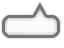

# Optimal In-App Remote SDK for iOS アプリのカスタマイズ

## 遠隔操作機能

既定では、オペレーターからの遠隔操作が有効になっています。

オペレーターから遠隔操作を要求された場合、既定ではそれを許可するかどうかのダイアログが表示され、ユーザーの選択結果に応じて以下のように振る舞います。

- 「許可」を選択した場合
  - オペレーターからの遠隔操作を受け入れるようになります
  - 再度遠隔操作を要求した場合、自動的に遠隔操作を受け入れます
- 「許可 (今回のみ)」を選択した場合
  - オペレーターからの遠隔操作を受け入れるようになります
  - 再度遠隔操作を要求した場合、ダイアログが表示されます
- 「拒否」を選択した場合
  - オペレーターからの遠隔操作を受け入れません
  - 再度遠隔操作を要求した場合、ダイアログが表示されます

### 遠隔操作機能を無効化する

オペレーターからの遠隔操作を無効にしたい場合、`ORIASession` クラスのインスタンスを作成した直後に `remoteInputEnabled` プロパティを `NO` にしてください。`NO` にすると、遠隔操作を許可するかどうかのダイアログは表示されず、遠隔操作も実行されません。

### 遠隔操作機能をダイアログなしで自動的に許可する

オペレーターからの遠隔操作をダイアログなしで自動的に許可したい場合、`ORIASession` クラスのインスタンスを作成した直後に `remoteInputAcceptsAutomaticallyEnabled` プロパティを `YES` にしてください。`YES` にすると、遠隔操作を許可するかどうかのダイアログは表示されず、自動的に遠隔操作が許可されます。

## 音声通話機能

既定では、オペレーターとの音声通話が無効になっています。

オペレーターとの音声通話が有効になっている場合、オペレーターから音声通話を要求されると音声通話を開始します。

ユーザーは、オペレーターとの接続中に表示されるアイコンをタップすると開くメニューから、必要に応じて以下を調整できます。

- スピーカーから音声を出力するようにするかどうか (ハンズフリー)
  − マイクをミュートするかどうか

### 音声通話機能を有効化する

オペレーターとの音声通話を有効にしたい場合、`ORIASession` クラスのインスタンスを作成した直後に `voiceChatEnabled` プロパティを `YES` にしてください。

### ヘッドフォンがない場合にスピーカーから音声を出力するようにする

ヘッドフォンがない場合にスピーカーから音声を出力するようにしたい場合、`ORIASession` クラスのインスタンスを作成した直後に `voiceChatOverridesSpeakerWhenNoHeadphones` プロパティを `YES` にしてください。ヘッドフォンを接続すると、スピーカーから音声を出力するように設定していてもヘッドフォンから音声を出力するようになりますが、ユーザーがメニューからスピーカーから音声を出力するように設定した場合はその限りではありません。

## WKWebView の画面共有

iOS 8 以降で WKWebView の表示画面を画面共有したい場合、 `ORIASession` クラスのインスタンスを作成した直後に `screenSharingBestEffortCaptureEnabled` プロパティを `YES` にしてください。

### ソースコード例

<details open>
<summary>Swift</summary>

```swift
if let systemVersion = Float(UIDevice.current.systemVersion) {
    session.screenSharingBestEffortCaptureEnabled = systemVersion >= 8.0
}
```

</details>

<details>
<summary>Objective-C</summary>

```objectivec
self.session.screenSharingBestEffortCaptureEnabled = [[[UIDevice currentDevice] systemVersion] floatValue] >= 8.0;
```

</details>

## SDK 表示 の言語切り替え

SDK が UI 上に表示している言語を切り替えるには以下のように`ORIASession`クラスの`setLocale`メソッドを呼び出してください。

<details open>
<summary>Swift</summary>

```swift
// 英語に切り替える
self.session.setLocale(Locale.en)

// 日本語に切り替える
self.session.setLocale(Locale.ja)

// 端末設定に従う
self.session.setLocale(Locale.system)
```

</details>

<details>
<summary>Objective-C</summary>

```objc
// 英語に切り替える
[self.session setLocale:LocaleEn];

// 日本語に切り替える
[self.session setLocale:LocaleJa];

// 端末設定に従う
[self.session setLocale:LocaleSystem];
```

</details>

## SDK 表示 UI のデザインカスタマイズ

SDK が表示する UI の画像や文言はカスタマイズすることができます。

### 画像のカスタマイズ

[2. OptimalRemoteResources ディレクトリ をプロジェクトに追加する](../README.md#2-optimalremoteresources-ディレクトリ-をプロジェクトに追加する)にて、追加する画像を変更することでカスタマイズすることができます。

例として、サポート中のアイコンを変更したい場合は`OptimalRemoteIcon.png`というファイル名で、カスタマイズ後の画像をプロジェクトに追加してください。

カスタマイズできる画像と対応するファイル名は以下のとおりです。

| 項番 | 画像                                 | 備考                                         | デフォルト                                                                                        | 推奨サイズ（Retina ディスプレイでの倍率） |
| ---- | ------------------------------------ | -------------------------------------------- | ------------------------------------------------------------------------------------------------- | ----------------------------------------- |
| 1    | `OptimalRemoteIcon.png`              | 画面共有中のアイコン                         |               | 114 px × 114 px                           |
| 2    | `OptimalRemoteBalloonOnTopRight.png` | 画面共有開始時に表示する吹き出し             |  | 64 px × 48 px                             |
| 3    | `OptimalRemoteBanner.png`            | 画面上部に表示されるロゴ画像                 |             | 206 px × 32 px                            |
| 4    | `OptimalRemoteTicketBackground.png`  | 受付番号の背景画像                           |   | 512 px × 210 px                           |
| 5    | `OptimalRemoteSpeakerLoud.png`       | 画面共有中メニューのスピーカーオン時のボタン |        | 144 px × 144 px                           |
| 6    | `OptimalRemoteSpeakerNormal.png`     | 画面共有中メニューのスピーカーオフ時のボタン |      | 144 px × 144 px                           |
| 7    | `OptimalRemoteMicOn.png`             | 画面共有中メニューのマイクオン時のボタン     |              | 144 px × 144 px                           |
| 8    | `OptimalRemoteMicOff.png`            | 画面共有中メニューのマイクオフ時のボタン     |             | 144 px × 144 px                           |
| 9    | `OptimalRemoteDisconnect.png`        | 画面共有中メニューの切断ボタン               |         | 144 px × 144 px                           |

> [!WARNING]
> 画像は png のみ対応しております。

> [!WARNING]
> 推奨サイズを大きく超える、または大きく下回る場合は UI がレイアウト崩れする場合がございます。

### 文言のカスタマイズ

[2. OptimalRemoteResources ディレクトリ をプロジェクトに追加する](../README.md#2-optimalremoteresources-ディレクトリ-をプロジェクトに追加する)で追加した`OptimalRemoteLocalizable.strings`の文言を変更することでカスタマイズすることができます。

- 日本語：[OptimalRemoteResources/ja.lproj/OptimalRemoteLocalizable.strings](../OptimalRemoteResources/ja.lproj/OptimalRemoteLocalizable.strings)
- 英語：[OptimalRemoteResources/en.lproj/OptimalRemoteLocalizable.strings](../OptimalRemoteResources/en.lproj/OptimalRemoteLocalizable.strings)

例として、 画面共有中メニューの切断ボタンの英語版のラベルを`DISCONNECT`に変更する場合を以下に示します。

```diff
--- a/OptimalRemoteResources/en.lproj/OptimalRemoteLocalizable.strings
+++ b/OptimalRemoteResources/en.lproj/OptimalRemoteLocalizable.strings
@@ -53,4 +53,4 @@

 "ORIAAssistiveMenuSpeakerButtonLabel" = "Speaker";
 "ORIAAssistiveMenuMuteButtonLabel" = "Mute";
-"ORIAAssistiveMenuDisconnectButtonLabel" = "Disconnect";
+"ORIAAssistiveMenuDisconnectButtonLabel" = "DISCONNECT";
```

カスタマイズできる文言と対応するキーは以下のとおりです。

| 項番 | キー                                     | 備考                                         | デフォルト（日本語）                                 | デフォルト（英語）                                  |
| ---- | ---------------------------------------- | -------------------------------------------- | ---------------------------------------------------- | --------------------------------------------------- |
| 1    | `ORIABalloonTapToExitMessage`            | 画面共有開始時の吹き出し内の文言             | `終了する場合は\r\nタップしてください。`             | `Tap above icon to exit.`                           |
| 2    | `ORIADidReserveMessage`                  | 受付番号の上に表示される文言                 | `下記の受付番号を\r\nオペレーターにお伝えください。` | `Please tell below \r\nReceipt Number to operator.` |
| 3    | `ORIADialogSDPCancelButtonTitleCancel`   | 受付番号の下に表示されるボタンのラベル       | `中断する`                                           | `Cancel`                                            |
| 4    | `ORIAAssistiveMenuSpeakerButtonLabel`    | 画面共有中メニューのスピーカーボタンのラベル | `スピーカー`                                         | `Speaker`                                           |
| 5    | `ORIAAssistiveMenuMuteButtonLabel`       | 画面共有中メニューのマイクオンボタンのラベル | `消音`                                               | `Mute`                                              |
| 6    | `ORIAAssistiveMenuDisconnectButtonLabel` | 画面共有中メニューの切断ボタンのラベル       | `切断`                                               | `Disconnect`                                        |

> [!WARNING]
> デフォルトの文言の文字数を大きく超える、または大きく下回る場合は UI がレイアウト崩れする場合がございます。

## マスキング機能

オペレーターツールに共有したくない View はマスキングすることができます。

### タグの指定

共有したくない View の [tag](https://developer.apple.com/documentation/uikit/uiview/tag) を指定し、対象の View をマスキングして表示します。

例として、「100」、「101」のタグがついた View をマスキングする場合は以下のように実装してください。

<details open>
<summary>Swift</summary>

```swift
self.session.setMaskElements([100, 101])
```

</details>

<details>
<summary>Objective-C</summary>

```objectivec
[self.session setMaskElements:@[@100, @101]];
```

</details>

### ViewController の継承

画面遷移のアニメーション中に一瞬マスキングの対象 View が共有されないように、画面遷移を検知する必要があります。

SDK 指定の ViewController を継承してください。

<details open>
<summary>Swift</summary>

```swift
class XxxViewController: ORIAMaskViewController {
// ...
}
```

</details>

<details>
<summary>Objective-C</summary>

```objectivec
@interface XxxViewController: ORIAMaskViewController
// ...
@end
```

</details>
